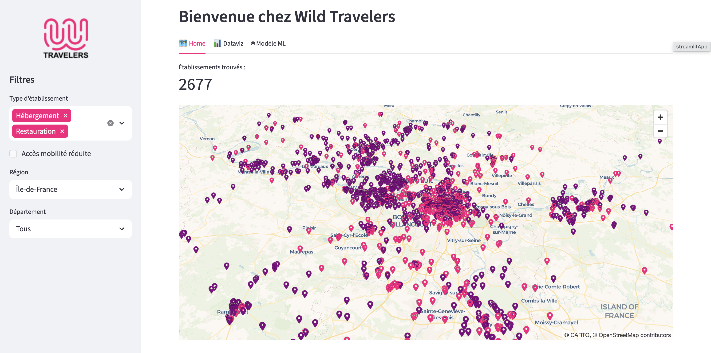

# 🧳 Wild Travelers

**Wild Travelers** est une application interactive de découverte d'hébergements et de restaurants en France, développée dans le cadre d'un projet à la [Wild Code School](https://www.wildcodeschool.com/).



👉 [Accéder à l'application](https://wild-travelers.streamlit.app)

---

## Description

L'application permet à l'utilisateur de :

- **Explorer** les établissements (hôtels et restaurants) sur une carte interactive, filtrés par région, département et ville
- **Visualiser** la répartition des établissements à travers la France via plusieurs graphiques
- **Tester** un modèle de classification NLP qui prédit le type d'un établissement à partir de sa description

## Source des données

Les données proviennent de [DATAtourisme](https://www.datatourisme.fr), la plateforme nationale d'information touristique en open data.

## Stack technique

- **Streamlit** — interface web interactive
- **Pandas** — manipulation des données
- **Pydeck** — cartographie interactive
- **Matplotlib / Seaborn** — visualisations
- **Scikit-learn** — modèles de classification (TF-IDF + Régression Logistique)
- **NLTK** — prétraitement du texte (tokenisation, stop words, stemming)

## Lancer l'application en local

```bash
# Cloner le repo
git clone https://github.com/Binn1908/wild-travelers.git
cd wild-travelers

# Installer les dépendances
pip install -r requirements.txt

# Lancer l'application
streamlit run app.py
```
